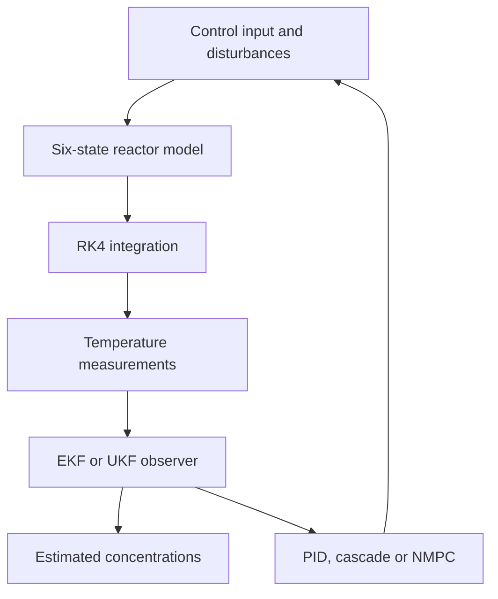

# Yanko Process Lab — Numerical Core

An educational nonlinear process simulator connecting chemical engineering, control systems, software and interactive learning.

**[Open the existing public visualization](https://yanko-process-lab.walteryanko.chatgpt.site)**

This repository contains the real numerical core and CLI tests extracted from that application. The full website is not included: thesis files, reference figures, fonts and other frontend assets still require a distribution review.

## Problem and academic origin

Temperatures are measurable, but internal species concentrations may not be directly available. A six-state continuous stirred-tank reactor with a cooling coil provides a concrete way to study nonlinear dynamics, state observers, virtual sensors and feedback control.

The implementation is an educational reimplementation informed by academic process-control material. It is not an industrial controller or a claim to reproduce every numerical result of the source dissertation.



## Implemented stack

TypeScript numerical modules with no external runtime dependencies: model, matrix operations, integration engine, EKF/UKF observers and controllers. The existing public site uses a React-based visualization; this excerpt runs with Node's TypeScript support.

State: `x = [CA, CB, CC, CM, T, Tt]`; measured output: `y = [T, Tt]`. Simulation uses fourth-order Runge–Kutta and seeded noise. The nonlinear predictive controller uses deterministic coordinate search; it is not the original MATLAB `fmincon`/SQP optimizer.

## Run

Node.js 24 or later. No npm dependencies or external services.

```sh
git clone https://github.com/walteryanko/yanko-process-lab.git
cd yanko-process-lab
npm test
npm run demo
```

The demo executes 100 simulation steps and prints measured and estimated state values. Tests exercise the actual engine. The live site is a separately deployed application; passing CLI tests does not reverify every browser interaction.

## Tested

Eleven tests cover equilibrium stationarity, species conservation, RK4 step-halving consistency, disturbance units, seeded replay, pause semantics, all controller/observer combinations, actuation freeze with observer off, thermal-stop reset, invalid settings and extreme tuning/noise cases. These are numerical invariants and behavior checks, not plant validation.

## Scientific limitations

With the implemented parameters, the calculated nominal temperature is approximately **340.30349 K**. The academic reference value is **332.3 K**: a discrepancy of about **8.00349 K**. The discrepancy is exposed rather than hidden by retuning. This prevents claims of exact reproduction.

Typical configuration uses a 0.015 h sampling interval and 800 steps (12 h). The 355.4 K stop is an educational simulation guard, not a certified safety system. The model, observability assumptions, noise process and search-based controller simplify reality. No plant data or closed-loop hardware test is included.

[Scientific scope](docs/SCIENTIFIC_SCOPE.md) · [Provenance](docs/PROVENANCE.md)

## License and product boundary

MIT applies only to the authorized first-party numerical code, tests, CLI, original documentation and diagrams in this repository. It does not grant rights over third-party research, papers, fonts, datasets or assets.

The repository contains the numerical core. Academic PDFs, thesis excerpts, published figures, website images, fonts and the full frontend are not redistributed. The existing public visualization remains a separate deployment. See THIRD_PARTY_NOTICES.md.

See [LICENSE](LICENSE) for the unmodified MIT text and [LICENSE_SCOPE.md](LICENSE_SCOPE.md) for scope and branding. `private: true` prevents accidental publication to the npm registry; it does not restrict the public repository's license.

## Continuous verification

The [Verify workflow](.github/workflows/verify.yml) runs the real tests and CLI demo on Node 24. See [GitHub Actions](https://github.com/walteryanko/yanko-process-lab/actions) for current run results. No separate lint or static typecheck is configured. Historical local test results describe this excerpt only.
